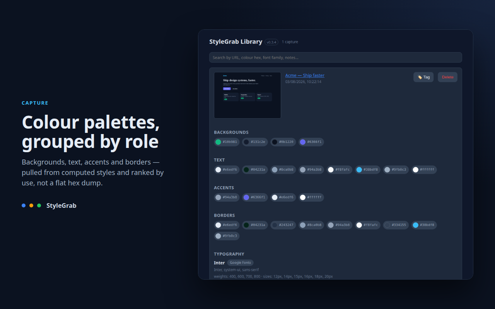
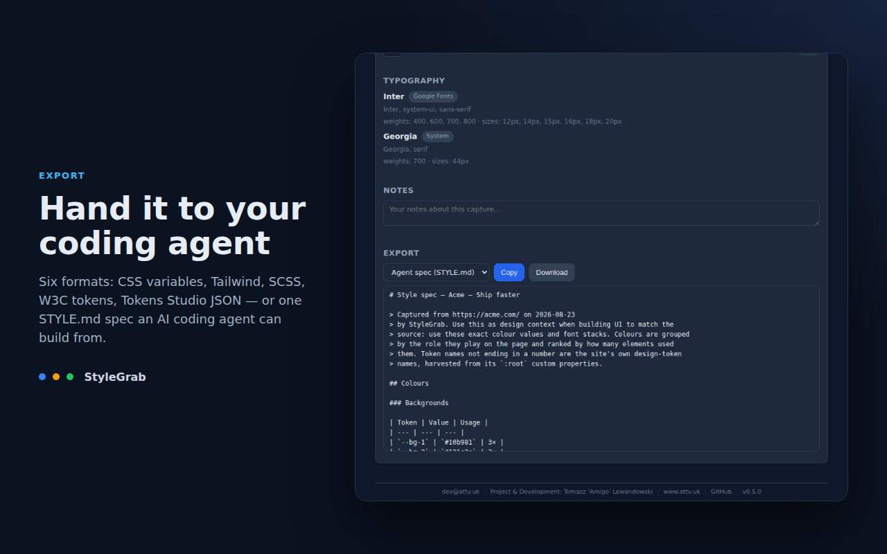
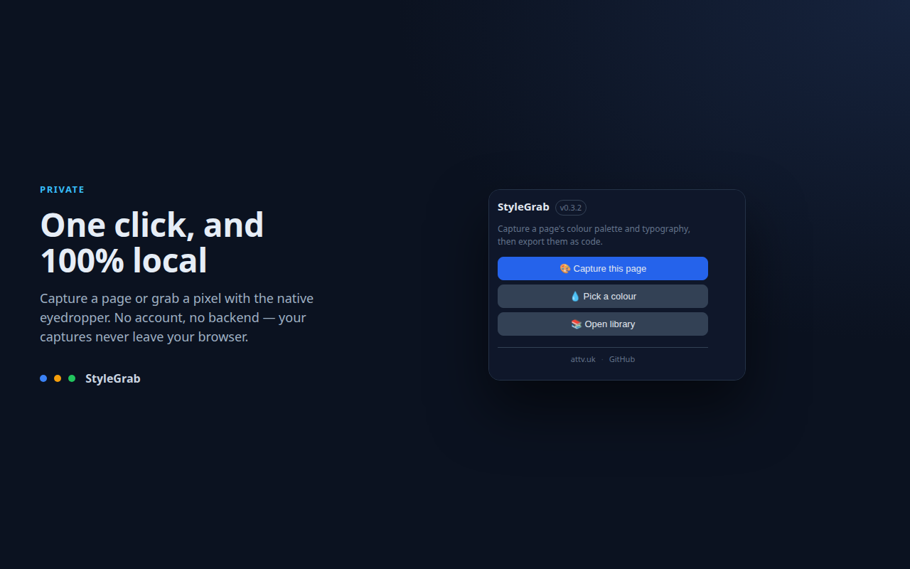
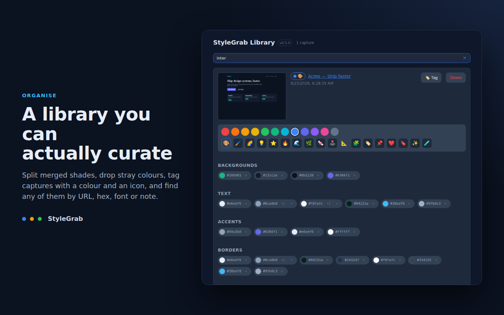

# StyleGrab — Design tokens from any website

> Capture palettes, typography and colours. Export as code, not screenshots.

[](https://github.com/AmigoUK/StyleGrab/actions/workflows/ci.yml)
[](https://github.com/AmigoUK/StyleGrab/releases/latest)
[](./LICENSE)

StyleGrab captures the visual DNA of any website and turns it into code you can
actually use. Open a page, grab its palette and type stack, and export a file
you paste straight into your project — no transcribing hex codes from a
screenshot.

**[stylegrab site](https://amigouk.github.io/StyleGrab/)** ·
**[privacy policy](https://amigouk.github.io/StyleGrab/privacy/)** ·
**[releases](https://github.com/AmigoUK/StyleGrab/releases)**


## What it does

Open any page and StyleGrab extracts its **colour palette** from computed
styles, grouped by role — backgrounds, text, accents — not just a flat list of
hex values. It reads the **typography** stack too: font families, weights and
sizes per element, with the font source identified (Google Fonts, Adobe Fonts
or self-hosted). Need one specific colour? The built-in **eyedropper** uses
Chrome's native `EyeDropper` API for pixel-perfect picking anywhere on screen.

Every capture is saved as a card — screenshot thumbnail, palette, typography,
URL and your notes — in a **local library** you can browse and search.

| | |
|---|---|
|  |  |
|  |  |

## Built for developers

Other tools show you colours. StyleGrab hands you a file. One click exports any
card as:

- CSS custom properties
- Tailwind config
- SCSS variables
- W3C design tokens (JSON)

## Privacy first

No account. No backend. No data transmission. Everything lives in your
browser's local storage — your captures never leave your machine. Free, with no
premium tier and no upsell. See [PRIVACY.md](./PRIVACY.md).

### Permissions explained

- **activeTab** — reads styles only on the page you trigger it on
- **storage** — saves your library locally
- **scripting** — injects the style scanner on demand, never in the background

There are deliberately **no** `host_permissions` and no `tabs` permission — the
screenshot thumbnail is taken with `captureVisibleTab`, which works under
`activeTab` on your click. The end-to-end suite asserts this on every run, so
the permission set cannot drift.

## Install

A Chrome Web Store listing is on its way. Until then, load the build by hand:

1. Download the `.zip` from the [latest release](https://github.com/AmigoUK/StyleGrab/releases/latest) and unpack it — or build it yourself (below).
2. Open `chrome://extensions` and turn on **Developer mode**.
3. Choose **Load unpacked** and select the unpacked folder (or `.output/chrome-mv3`).

Needs Chrome 116 or newer.

## Tech stack

| | |
|---|---|
| Build framework | [WXT](https://wxt.dev) 0.20 (Manifest V3) |
| UI | [Preact](https://preactjs.com) 10.24 |
| Language | TypeScript 5.6 (strict) |
| Bundler | Vite 8.1 (via WXT) |
| Tests | Vitest 4.1 (unit + component), Playwright 1.61 (end-to-end) |
| Styling | hand-written CSS custom properties (no Tailwind in the UI itself) |

Consistent with its sibling project **UsrHelper**.

## Development

```bash
npm install      # installs deps and runs `wxt prepare`
npm run dev      # launches Chrome with the extension in watch mode
npm run compile  # type-check (tsc --noEmit)
npm run test     # unit + component tests
npm run build    # production build → .output/chrome-mv3
npm run zip      # packaged .zip for the Chrome Web Store
```

Load an unpacked build from `.output/chrome-mv3` via
`chrome://extensions` → *Load unpacked*.

## Testing

Three layers, all runnable locally and all gated in CI:

```bash
npm run test           # 123 unit + component tests (Vitest, jsdom)
npm run test:coverage  # same, with enforced coverage thresholds
npm run build && xvfb-run -a npm run e2e:all
```

- **Unit** — the pure logic: colour parsing and role grouping, typography
  aggregation, font-source detection, the four exporters, search, storage and
  the IndexedDB thumbnail store.
- **Component** — the popup, library and card rendered in jsdom against a single
  fake `chrome` API (`tests/setup.ts`), driven through the DOM a user clicks.
- **End-to-end** — Playwright against the *built* extension loaded into Chromium:
  - `e2e` — the library page renders its empty state
  - `e2e:capture` — the real scanner reads computed styles and font URLs from a
    rendered page
  - `e2e:flow` — 27 checks covering the manifest guarantees, the popup's guard
    rails, the background's capture refusal, and the whole library journey from
    card to export to delete

MV3 needs a headed browser, hence `xvfb-run` where there is no display.

The same harness (`scripts/lib/harness.mjs`) generates the store assets and the
README GIF, so every screenshot in this repo comes from the real extension:

```bash
xvfb-run -a npm run shots   # docs/store/*.png
xvfb-run -a npm run gif     # docs/capture-export.gif (needs ImageMagick)
```

## Publishing

Store copy, permission justifications and data-usage answers live in
[docs/STORE_LISTING.md](./docs/STORE_LISTING.md); the dashboard walkthrough is
in [docs/STORE_SUBMISSION.md](./docs/STORE_SUBMISSION.md).

## Roadmap

- **v0.1** ✅ — colour palette (by role) + typography + font-source detection +
  capture card in the library + CSS custom properties export
- **v0.2** ✅ — native EyeDropper + Tailwind / SCSS / W3C exporters + colour/icon
  picker for tagging cards
- **v0.3** ✅ — library search + notes + privacy policy + Chrome Web Store listing + e2e smoke
- **v0.4** ✅ — Chrome Web Store readiness: component and end-to-end suites, CI,
  assets captured from the real extension, project site and hosted privacy policy

See [CHANGELOG.md](./CHANGELOG.md) for released changes.

## Contributing

Open source on GitHub — issues and PRs welcome.

## License

[MIT](./LICENSE) © 2026 Tomasz 'Amigo' Lewandowski

---

<sub>dev@attv.uk · Project &amp; Development: Tomasz 'Amigo' Lewandowski · [www.attv.uk](https://www.attv.uk) · [GitHub](https://github.com/AmigoUK/StyleGrab)</sub>
