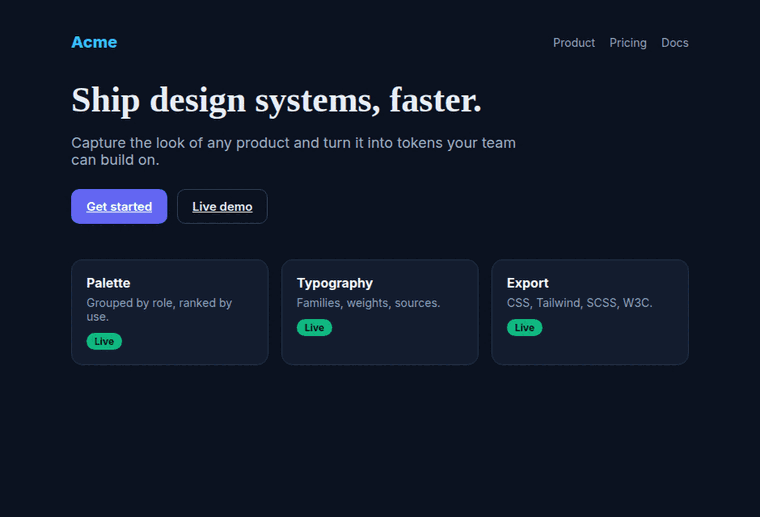

# StyleGrab — Design tokens from any website

> Capture palettes, typography and colours. Export as code, not screenshots.

StyleGrab captures the visual DNA of any website and turns it into code you can
actually use. Open a page, grab its palette and type stack, and export a file
you paste straight into your project — no transcribing hex codes from a
screenshot.



## What it does

Open any page and StyleGrab extracts its **colour palette** from computed
styles, grouped by role — backgrounds, text, accents — not just a flat list of
hex values. It reads the **typography** stack too: font families, weights and
sizes per element, with the font source identified (Google Fonts, Adobe Fonts
or self-hosted). Need one specific colour? The built-in **eyedropper** uses
Chrome's native `EyeDropper` API for pixel-perfect picking anywhere on screen.

Every capture is saved as a card — screenshot thumbnail, palette, typography,
URL and your notes — in a **local library** you can browse and search.

## Built for developers

Other tools show you colours. StyleGrab hands you a file. One click exports any
card as:

- CSS custom properties
- Tailwind config
- SCSS variables
- W3C design tokens (JSON)

## Privacy first

No account. No backend. No data transmission. Everything lives in your
browser's local storage — your captures never leave your machine. Free, with no
premium tier and no upsell.

### Permissions explained

- **activeTab** — reads styles only on the page you trigger it on
- **storage** — saves your library locally
- **scripting** — injects the style scanner on demand, never in the background

There are deliberately **no** `host_permissions` and no `tabs` permission — the
screenshot thumbnail is taken with `captureVisibleTab`, which works under
`activeTab` on your click.

## Tech stack

| | |
|---|---|
| Build framework | [WXT](https://wxt.dev) 0.20 (Manifest V3) |
| UI | [Preact](https://preactjs.com) 10.24 |
| Language | TypeScript 5.6 (strict) |
| Bundler | Vite 8.1 (via WXT) |
| Tests | Vitest 4.1 (unit), Playwright 1.61 (E2E smoke) |
| Styling | hand-written CSS custom properties (no Tailwind in the UI itself) |

Consistent with its sibling project **UsrHelper**.

## Development

```bash
npm install      # installs deps and runs `wxt prepare`
npm run dev      # launches Chrome with the extension in watch mode
npm run compile  # type-check (tsc --noEmit)
npm run test     # unit tests
npm run build    # production build → .output/chrome-mv3
npm run zip      # packaged .zip for the Chrome Web Store
```

Load an unpacked build from `.output/chrome-mv3` via
`chrome://extensions` → *Load unpacked*.

## Roadmap

- **v0.1** ✅ — colour palette (by role) + typography + font-source detection +
  capture card in the library + CSS custom properties export
- **v0.2** ✅ — native EyeDropper + Tailwind / SCSS / W3C exporters + colour/icon
  picker for tagging cards
- **v0.3** ✅ — library search + notes + privacy policy + Chrome Web Store listing + e2e smoke

See [CHANGELOG.md](./CHANGELOG.md) for released changes.

## Contributing

Open source on GitHub — issues and PRs welcome.

## License

[MIT](./LICENSE) © 2026 Tomasz 'Amigo' Lewandowski

---

<sub>dev@attv.uk · Project &amp; Development: Tomasz 'Amigo' Lewandowski · [www.attv.uk](https://www.attv.uk) · [GitHub](https://github.com/AmigoUK/StyleGrab)</sub>
